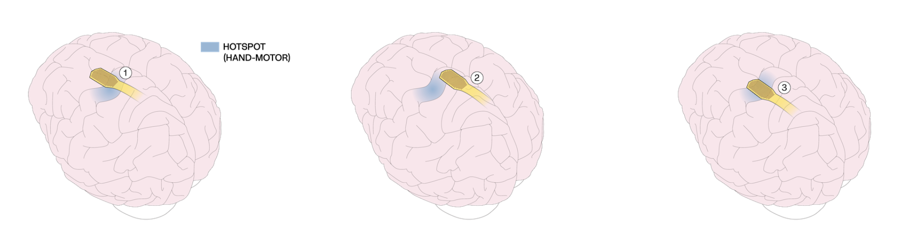

# Track 2: The "Compass" Challenge

## Problem Statement

The performance of a Brain-Computer Interface (BCI) relies heavily on the source of its signal. Because different areas of the cortex control specific functions—such as movement or sensation—decoding a user's intent (e.g., "move hand") requires the Layer7 micro-ECoG array to be placed precisely over the relevant brain region (e.g., the "hand knob" of the motor cortex).

While anatomical (MRI) and functional (fMRI) imaging provide a general roadmap for surgery, they lack the resolution needed for final, millimeter-level adjustments. Once the array is implanted, **it cannot be repositioned** easily. Therefore, the neurosurgical team needs a tool to fine-tune placement intraoperatively.

By using the Layer7 array itself to record high-resolution neural activity from an awake patient, we can determine in real-time if the array is sitting on the optimal "hotspot" for decoding intention.

## The Challenge

**Design and build an array placement web application.** We need a real-time visualization interface that guides the neurosurgeon to the optimal implant site.

Your application must:
- Process the incoming neural data stream in real-time
- Identify **areas** of functionally tuned neural activity (not just individual transient hotspots)
- Visualize their location relative to the array

### What We're Looking For

At minimum, your solution should:
- **Visualize tuned regions** relative to the array position in a way that's immediately interpretable
- Help the user understand **where** on the array the functional activity is concentrated

Beyond the basics, consider:
- **Directional guidance**: Where should the surgeon move the array to optimize placement?
- **Confidence indication**: How certain is the system about the hotspot location?
- **"Found it" signal**: A clear indication when the array is well-positioned

### Understanding the Signal

The neural activity over tuned regions is **not uniform** — it depends on the cursor's movement direction at each moment. Different tuned regions activate based on movement direction (e.g., Vx+ activates during rightward movement, Vy- during downward movement).

A good solution will recognize that these individual activations belong to a coherent **area of interest** and are not individually important in isolation. Consider how to aggregate or smooth the signal over time to identify stable regions rather than chasing transient spikes.

See [Data](data.md) for signal content and [Getting Started](getting_started.md) for signal processing guidance.

### Design Freedom

The interface must be designed for the high-pressure environment of the Operating Room. It needs to stand out from other environmental stimuli and provide the clinical team with clear, unambiguous feedback—acting as a **"Compass"** to confirm when they have located the target brain region.

## Design Constraints

### Technical Implementation

Develop a web-based or local application that visualizes the functional tuning of the cortex directly beneath the Layer7 array.

**Data Source**: A continuous stream of simulated neural data (see [Data Stream](data_stream.md)). The data simulates a recording session where the array is physically moved across a brain region functionally tuned to motor behavior. During live evaluation, you control the array position interactively.

**Real-Time Processing**: Your dashboard must ingest raw data in real-time and instantly output visual feedback indicating the presence, absence, and relative location of tuned regions. See [Getting Started](getting_started.md) for signal processing guidance.

### The "OR-Ready" User Experience

The Operating Room (OR) is a high-cognitive-load environment. To minimize cognitive load and risk for errors, Clinical Operators (see [User Persona](user_persona.md)) should be presented with an unambiguous, intuitive UI.

- **Zero-Training Interface**: The visualization must be intuitive enough that a user understands the feedback immediately without explanation.
- **Distance Viewing**: Design for a "6-foot UI." Ensure high contrast, large indicators, and unambiguous visuals.
- **Latency**: The application must provide feedback with minimal delay to support rapid decision-making.

## Deliverables

### 1. The Dashboard

A functional web-based or local application that processes the data stream and visualizes array placement guidance.

### 2. The Pitch

A 3–5 minute video demonstration acting as a "Product Walkthrough." Treat this as a pitch to a neurosurgeon: demonstrate how the app reacts to the data in real-time and explain why your visualization method is the safest, most efficient choice for the OR.

See [Submissions](submissions.md) for video requirements and submission instructions.

## Judging Criteria

### 40% | User Experience & "Glanceability"

- **Clarity & Intuitiveness**: Can a surgeon interpret the guidance instantly (under 1 second) without confusion? Is the "go/no-go" signal unambiguous?
- **Operating Room Suitability**: Is the design appropriate for a clinical setting (high contrast, readable from a distance, uncluttered)?
- **Feedback Loop**: How effectively does the UI guide the user toward the hotspot? Does it prevent overshooting or confusion?

### 40% | Technical Execution & Accuracy

- **Signal Processing**: How accurately does the solution extract the "hints" (e.g., spectral power/kinematic correlations) from the raw voltage data to identify the hotspot?
- **Latency & Performance**: Does the dashboard render updates in near real-time? Can it handle the data throughput without crashing?
- **Dynamic Response**: How smoothly does the system handle the transition as the hotspot moves in and out of the array's field of view?

### 20% | Innovation & Presentation

- **Visual Creativity**: Did the team move beyond a simple heatmap to create a truly novel navigation aid (e.g., vector fields, directional arrows, confidence scores)?
- **The Pitch**: How compelling was the video demo? Did it clearly articulate the problem and the solution?
